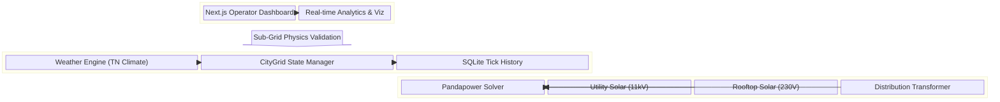
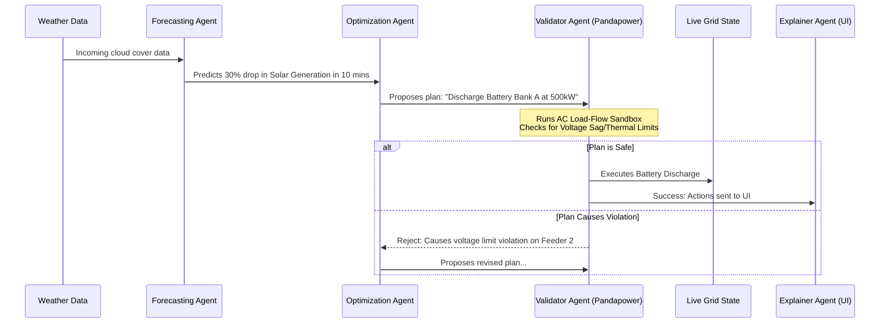

# GridMind: TANGEDCO-Aligned Smart Grid Digital Twin
## Faculty Alignment & Architecture Document

This document outlines how the GridMind project aligns with real-world Tamil Nadu (TANGEDCO) grid operations and addresses critical electrical engineering and power systems concepts. It is designed to demonstrate that GridMind is not a generic dashboard, but a physics-grounded, AI-driven decision-support sandbox.

---

### 1. Real-World Alignment: TANGEDCO & TN Grid

GridMind acts as a **Decision-Support and Training Sandbox** that mirrors the actual operational realities of the Tamil Nadu grid.

*   **Not a Literal Controller, but a Digital Twin:** We do not claim to directly control the live TANGEDCO grid. Instead, we are building a virtual replica—a "Digital Twin." This aligns perfectly with the **National Smart Grid Mission's (NSGM)** ongoing pilot projects, which fund digital twins to let operators rehearse scenarios safely without touching live infrastructure.
*   **Regulatory & Tariff Grounding:** The simulation honors Tamil Nadu's specific commercial realities:
    *   **Net Metering:** Implementing the standard TN model where rooftop solar exports are credited against consumption on the bill, rather than direct peer-to-peer selling (which is still experimental).
    *   **Agricultural Free Power:** Modeling the massive agricultural load specific to TN, reflecting the actual state subsidy schemes.

---

### 2. Addressing Grid Physics (Faculty Questions)

We have explicitly modeled the electrical behavior of different grid assets to reflect reality:

*   **Utility-Scale vs. Rooftop Solar:**
    *   *Utility Solar (e.g., Kamuthi):* Modeled with an inverter and a **Step-Up Transformer** that raises the voltage to Medium Voltage (11kV/33kV) for transmission across the grid.
    *   *Rooftop Solar:* Output from the inverter is at Low Voltage (230V) and connects directly to the household meter.
*   **Physics of Distribution:** When a house generates excess solar, the current flows along the shared Low Voltage distribution feeder. Following basic circuit physics (path of least resistance), it is naturally consumed by the nearest demanding house on that transformer before spilling further up the grid.
*   **Accurate Voltage/Current via `pandapower`:** To ensure our simulation isn't just basic arithmetic, we are integrating **`pandapower`** (a standard open-source power systems solver). While high-level aggregation runs via standard simulation, specific distribution feeders are solved using `pandapower` to yield accurate AC per-unit voltage, current, and line losses.

---

### 3. System Architecture Diagram

This block diagram illustrates how the Backend Simulation, Pandapower physics solver, and the Frontend Dashboard interact.

---

### 4. AI Multi-Agent Architecture

To manage grid complexity, GridMind utilizes a state-of-the-art **Multi-Agent System**, inspired by recent power-systems AI research (like the *Grid-Agent* and *GridMind LLM* papers). Instead of a "black box" AI, we use a plan-then-validate approach.

#### Agent Flow Diagram

#### Roles of the Agents:
1.  **Forecasting Agent:** Anticipates shifts in generation (wind/solar drops) or demand peaks.
2.  **Optimization Agent:** Proposes remediation actions (e.g., dispatching storage, shedding non-critical load).
3.  **Validator Agent:** The safety net. It runs the proposed action through the `pandapower` sandbox to guarantee physical safety (no voltage violations) before execution.
4.  **Explainer Agent:** Translates these automated decisions into plain English for the human operator viewing the dashboard.
